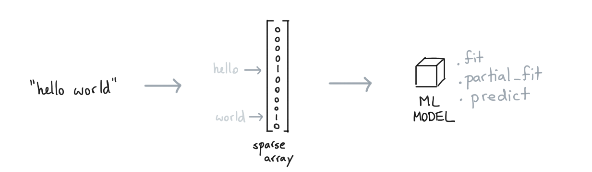
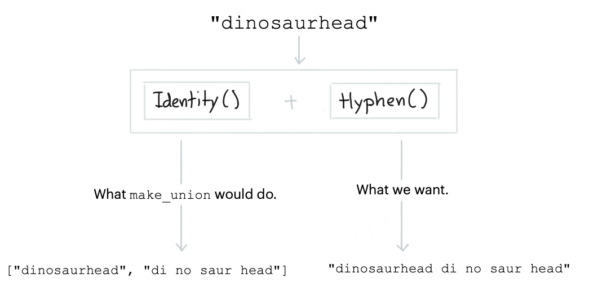

Scikit-Learn pipelines are amazing but they are not perfect for simple text use-cases. 

- The standard pipeline does not allow for interactive learning. You can 
apply `.fit` but that's it. Even if the tools inside of the pipeline have 
a `.partial_fit` available, the pipeline doesn't allow it. 
- The `CountVectorizer` is great, but we might need some more text-tricks 
at our disposal that are specialized towards text to make this object more effective.  

Part of what this library does is give more tools that extend scikit-learn for simple
text classification problems. In this document we will showcase some of the main features.

## Text Preparation Tools

Let's first discuss a basic pipeline for text inside of scikit-learn. 

### Base Pipeline 

This simplest text classification pipeline in scikit-learn looks like this; 


```python
from sklearn.pipeline import make_pipeline 
from sklearn.feature_extraction.text import CountVectorizer
from sklearn.linear_model import SGDClassifier

pipe = make_pipeline(
    CountVectorizer(), 
    SGDClassifier()
)
```

This pipeline will encode words as sparse features before passing them on to the logistic regression model. 
This pattern is very common and has proven to work well enough for many English text classification tasks.



The nice thing about using a `SGDClassifier` is that we're able to learn from our data even if the dataset
does not fit in memory. We can call `.partial_fit` instead of `.fit` and learn in a more "online" setting. 

That said, there are things we can do even to this pipeline to make it better.

### Spelling Errors 

When you are classifying online texts you are often confronted with spelling errors. To 
deal with this you'd typically use a [CountVectorizer](https://scikit-learn.org/stable/modules/generated/sklearn.feature_extraction.text.CountVectorizer.html) 
with a character-level analyzer such that you also encode subwords. 


With all of these subwords around, we'll be more robust against spelling errors.  
The downside of this approach is that you might wonder if we really *need* all these subwords. So how about this, 
let's add a step that will turn our text into subwords by splitting up hyphens. 

```python
from tokenwiser.textprep import HyphenTextPrep

multi = HyphenTextPrep().transform(["geology", "astrology"])

assert multi == ['geo logy', 'as tro logy']
```

The `HyphenTextPrep` preprocessor is a `TextPrep`-object. For all intents and purposes these are 
scikit-learn compatible preprocessing components but they all output strings instead of arrays. What's
nice about these though is that you can "retokenize" the original text. This allows you to use the 
subtokens as if they were tokens which might help keep your pipelines lightweight while still keeping
them robust against certain spelling errors. 

### Long Texts

There are some other tricks that you might want to apply for longer texts. Maybe you want to summarise a text before
vectorizing it. So maybe it'd be nice to use a transformer that keeps only the most important tokens. 

A neat heuristic toolkit for this is [yake](https://github.com/LIAAD/yake) (you can find a demo 
[here](http://yake.inesctec.pt/demo/sample/)). This package also features a scikit-learn compatible component for it.

```python
from tokenwiser.textprep import YakeTextPrep

text = [
  "Sources tell us that Google is acquiring Kaggle, \
   a platform that hosts data science and machine learning"
]
example = YakeTextPrep(top_n=3, unique=False).transform(text)

assert example[0] == 'hosts data science acquiring kaggle google is acquiring'
```

The idea here is to reduce the text down to only the most important words. Again, this trick 
might keep the algorithm lightweight and this trick will go a lot further than most "stopword"-lists.  

### Bag of Tricks! 

The goal of this library is to host a few meaningful tricks that might be helpful. Here's some more; 

- `Cleaner` lowercase text remove all non alphanumeric characters.
- `Identity` just keeps the text as is, useful when constructing elaborate pipelines.
- `PhoneticTextPrep` translate text into a phonetic encoding. 
- `SpacyPosTextPrep` add part of speech infomation to the text using spaCy.
- `SpacyLemmaTextPrep` lemmatize the text using spaCy.

All of these tools are part of the `textprep` submodule and are documented in detail 
[here](https://koaning.github.io/tokenwiser/api/textprep.html).

## Pipeline Tools 

Pipeline components are certainly nice. But maybe we can go a step further for text. Maybe
we can make better pipelines for text too!

### Concatenate Text

In scikit-learn you would use `FeatureUnion` or `make_union` to concatenate features in 
a pipeline. Ut is assumed that transformers output arrays that need to be concatenated so the
result of a concatenation is always a 2D array. This can be a bit awkward if you're using text preprocessors. 



The reason why we want to keep everything a string is so that the `CountVectorizer` from scikit-learn
can properly encode it. That is why this library comes with a special union
component: `TextConcat`. It concatenates the output of text-prep tools into a string instead of 
an array. Note that we also pack a convenient `make_concat` function too.

```python
from sklearn.pipeline import make_pipeline 

from tokenwiser.pipeline import make_concat
from tokenwiser.textprep import Cleaner, Identity, HyphenTextPrep

pipe = make_pipeline(
    Cleaner(),
    make_concat(Identity(), HyphenTextPrep()),
)

output = pipe.fit_transform(["hello astrology!!!!"])
assert output == ['hello astrology hel lo astro logy']
```

Again, we see that we're taking a text input and that we're generating a text output. The `make_concat`
is making sure that we concatenate strings, not arrays! This is great when we want to follow up with 
a `CountVectorizer!

```python
from sklearn.pipeline import make_pipeline 
from sklearn.linear_model import LogisticRegression
from sklearn.feature_extraction.text import CountVectorizer

from tokenwiser.pipeline import make_concat
from tokenwiser.textprep import Cleaner, Identity, HyphenTextPrep

pipe = make_pipeline(
    Cleaner(),
    make_concat(Identity(), HyphenTextPrep()),
    CountVectorizer(), 
    LogisticRegression()
)
```

The mental picture for `pipe`-pipeline looks like the diagram below. 


### Partial Fit 

We can go a step further though. The scikit-learn pipeline follows the `fit/predict` API. That
means that we cannot use `.partial_fit()`. Even if all the components in the pipeline are compatible 
with the `partial_fit/predict` API. That is why this library also introduced components for mini-batch 
learning: `PartialPipeline` and `make_partial_pipeline` 

In these scenarios you will need to swap out the `CountVectorizer` with a `HashVectorizer` in order to
be able to learn from new data comming in. 

```python
from sklearn.linear_model import SGDClassifier
from sklearn.feature_extraction.text import HashingVectorizer

from tokenwiser.textprep import Cleaner, Identity, HyphenTextPrep
from tokenwiser.pipeline import make_concat, make_partial_pipeline

pipe = make_partial_pipeline(
    Cleaner(),
    make_concat(Identity(), HyphenTextPrep()),
    HashingVectorizer(), 
    SGDClassifier()
)
```

This `pipe`-Pipeline is scikit-learn compatible for all intents and purposes
but it has the option of learning from batches of data via `partal_fit`. This is great
because it means that you're able to classify text even when it doesn't fit into memory!

> Note that all of the `TextPrep`-components in this library allow for `partial_fit`. 